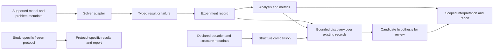

# Newton Lab

**Newton Lab is a Python research platform for studying mathematical structures through physical simulation, numerical experiments, and evidence-aware cross-domain hypothesis generation.**

> **Project status:** Research is paused for consolidation. Narrow maintenance is permitted; no new research phase is authorized. See the [project checkpoint](docs/project_checkpoint.md).

## 2-Minute Overview

Newton Lab provides numerical models and tools for asking bounded questions about how selected systems behave. It records solver outcomes, analyzes experiment records, compares declared mathematical structures, and helps report what the evidence does and does not support.

The intended reasoning chain is:

**model -> experiment -> measurement -> evidence -> limitation -> qualified conclusion**

For supported shared workflows, adapters connect model/problem specifications to solver families. Research studies may use their own frozen protocols and output formats; Newton Lab does not have one universal runner for every study.

The project has demonstrated results within declared mathematical models and synthetic protocols. Examples include second-order modal convergence for a specifically matched path/heat stencil and finite-time transient amplification in a bounded two-state matrix family. These do not establish physical validity, cross-domain equivalence, or usefulness in a target application. No independent engineering or financial application validation is documented.

## Research Workflow

This describes connected capabilities, not an automatic scientific pipeline. Structure comparison uses declared metadata; it does not prove symbolic or physical equivalence. Discovery consumes existing experiment records and does not autonomously discover laws.

## Architecture

| Layer | Current role | Representative implementation |
|---|---|---|
| Models and problem records | Define supported ODE, algebraic, and boundary-value problems | [dynamics.py](src/newton_lab/dynamics.py), [pendulum.py](src/newton_lab/pendulum.py), [algebraic.py](src/newton_lab/algebraic.py), [boundary_value.py](src/newton_lab/boundary_value.py) |
| Solver adapters and results | Run supported problems and preserve family-specific outcomes | [simulation.py](src/newton_lab/simulation.py), [simulation_adapters.py](src/newton_lab/simulation_adapters.py) |
| Experiments and analysis | Record runs and sweeps, compare references, summarize compatible metrics, estimate supported local sensitivities | [experiments.py](src/newton_lab/experiments.py), [experiment_analysis.py](src/newton_lab/experiment_analysis.py) |
| Knowledge and discovery | Store equation/source/structure metadata; compare declared features; propose reviewable hypotheses from existing experiment records | [knowledge/](src/newton_lab/knowledge/), [discovery.py](src/newton_lab/discovery.py) |
| Reporting and study outputs | Build supported plots/reports; retain protocol-specific outputs and manifests for selected studies | [visualization.py](src/newton_lab/visualization.py), [reports/](reports/) |

ODE trajectories, algebraic solution candidates, and BVP profiles have separate result types. Study-specific research modules keep their own protocols and artifacts rather than being forced into a universal interface.

## What Has Been Built

- **Physical model solvers:** damped harmonic oscillator and full-sine damped pendulum ODEs; a nonlinear algebraic root solver; and a separate collocation BVP solver with a steady one-dimensional heat-conduction example.
- **Experiment workflows:** typed experiment specifications and results, ordered single-parameter sweeps, retained point failures, analytical-reference comparisons, and central finite-difference sensitivity for supported examples.
- **Analysis and reporting:** experiment summaries, sweep analysis, explicit metric-compatibility checks, optional visualization, and Markdown reports. Cross-model metrics are not silently converted between units.
- **Knowledge records:** typed equation, source, relationship, and mathematical-structure metadata, with review states and declared evidence categories.
- **Bounded discovery:** selected behavioral descriptors and metadata comparisons can produce candidate structural connections and proposed application hypotheses for review. Equation expressions are stored as descriptive text, not parsed symbolic mathematics.

## Research Examples

### Phase 64: non-normal transient amplification

The study compared a stable normal matrix with a triangular non-normal matrix family sharing eigenvalues -1 and -2. In the declared abstract, dimensionless two-state coordinates and Euclidean norm, the largest sampled gain was **1.174353** at coupling kappa=4 and **2.080046** at kappa=8. The kappa=0 and kappa=2 cases did not exceed the study's positive-time amplification threshold.

This is finite-time amplification in the specified matrix family, measured on a finite time grid over [0, 4]. The matrices remain asymptotically stable. The sampled maxima are not asserted to be exact continuous-time maxima, and the abstract state has no physical interpretation. No physical or engineering application was tested.

Inspect the [Phase 64 report](docs/research/phase_64_non_normal_transient_growth.md), [frozen protocol](reports/phase_64_non_normal_transient_growth/protocol.json), [gain summary](reports/phase_64_non_normal_transient_growth/gain_summary.csv), and [SHA-256 manifest](reports/phase_64_non_normal_transient_growth/sha256_manifest.json). The artifact set contains tables and checks, but no figure; this README does not add a substitute graphic.

### Other bounded studies

- **Phase 48, path modes and heat diffusion:** on a uniform nearest-neighbor path with fixed leaders, the tested discrete low-mode rates approached the fixed-end heat-mode rates. The fitted grid-refinement orders were approximately two for modes 1-3. The result applies to the matched stencil and boundary setup, not arbitrary networks or a measured thermal system. [Report](docs/research/phase_48_pinned_path_convergence.md).
- **Phases 60-61, Kuramoto finite-size study:** simulated phase-only, all-to-all oscillators. At the largest tested sizes, transition intervals were too broad under the frozen criterion and point estimates straddled the continuum reference. The thread is **CLOSED — INCONCLUSIVE UNDER THE DECLARED PROTOCOL**; this does not establish that convergence is absent. [Phase 60](docs/research/phase_60_kuramoto_synchronization.md) | [Phase 61](docs/research/phase_61_kuramoto_transition_finite_size.md).
- **Phase 62, pitchfork path dependence:** a controlled ramp produced finite-rate path differences in the tested model. Whether a slower ramp reduces the loop remained inconclusive; the study does not establish rate-independent hysteresis or a general ramp law. [Report](docs/research/phase_62_pitchfork_path_dependence.md).

## Discovery and Evidence Categories

Discovery operates on existing experiment records and declared equation/structure metadata. It does not run solvers, infer arbitrary equations, establish causality, prove symbolic equivalence, or validate a target-domain application.

| Evidence category | Meaning in this project |
|---|---|
| **Established relationship** | A relationship recorded as derived or source-supported under its stated conditions; this is not automatically an application claim. |
| **Candidate structural connection** | A metadata-based match that still requires scientific review. |
| **Proposed application hypothesis** | A testable cross-domain idea with stated assumptions; it remains a hypothesis. |
| **Validated application** | Requires independent evidence in the target domain. No such validation is documented for the applications discussed in these studies. |

A resemblance between equations or declared features alone does not show that two systems are physically equivalent or that a method is useful in another domain. See the [discovery guide](docs/discovery.md) and [mathematical-structure guide](docs/mathematical_structure.md).

## Scientific Boundaries

- **Numerical verification** checks implementation against stated references, tolerances, or convergence criteria. It does not prove a general theorem.
- **Mathematical results** apply under their equations, branches, assumptions, and parameter conditions. Similar mathematical form does not by itself establish the same physical mechanism.
- **Physical validity** requires evidence that a model represents the system of interest. Synthetic runs do not supply that evidence.
- **Application usefulness** requires independent target-domain evaluation. The cited research does not validate engineering or financial applications.
- **Finance and data authorization:** Newton Lab is not a market-prediction or trading system and makes no profitability claim. Phase 32 remains BLOCKED_AUTHORIZATION; data access and intended-use permission remain unresolved.
- **Engineering qualification:** Phase 52 remains NO-GO; no candidate passed its documented qualification gates.

## Research Status

The project is paused for consolidation. The recovery-rate-scaling thread (Phases 48-57) is closed for now under Phase 58. The Kuramoto thread remains closed and inconclusive under its declared protocol. Phase 62 is complete as a bounded pilot, with its slower-ramp hypothesis inconclusive. Phase 64 is complete within its stated matrix family, norm, horizon, and sampled grids. **No new research phase is authorized.**

See the [project checkpoint](docs/project_checkpoint.md) for the current statuses and conditions for resuming work, and the [Research Atlas](docs/research/phase_51_research_atlas_and_roadmap.md) for the broader evidence record and roadmap.

## Quick Start

Newton Lab requires Python 3.11 or newer. From the repository root in PowerShell:

~~~powershell
python --version
python -m venv .venv
.\.venv\Scripts\Activate.ps1
python -m pip install -e ".[dev]"
~~~

If activation is unavailable, call the environment's executable directly:

~~~powershell
.\.venv\Scripts\python.exe -m pip install -e ".[dev]"
~~~

After installation, run a small oscillator example:

~~~powershell
.\.venv\Scripts\python.exe -c "from newton_lab.dynamics import simulate_damped_oscillator; print(simulate_damped_oscillator(1.0, 0.2, 4.0, 0.1, 0.0, 10.0).displacement_m[-1])"
~~~

For optional plots, install the visualization extra:

~~~powershell
python -m pip install -e ".[dev,visualization]"
~~~

## Project Structure

~~~text
.
├── docs/
│   └── research/
├── reports/
│   └── phase_64_non_normal_transient_growth/
├── src/
│   └── newton_lab/
├── tests/
└── pyproject.toml
~~~

## Testing and Quality

The dev extra provides pytest, Ruff, and mypy. Run them from PowerShell with the project environment:

~~~powershell
.\.venv\Scripts\python.exe -m pytest
.\.venv\Scripts\ruff.exe check .
.\.venv\Scripts\ruff.exe format --check .
.\.venv\Scripts\mypy.exe src
~~~

These are documented checks, not claims that they were run as part of this presentation update.

## Start Here

- [Project checkpoint](docs/project_checkpoint.md) - current pause, official statuses, and resumption conditions.
- [Technical project summary](docs/portfolio_project_summary.md) - architecture and implementation map.
- [Simulation architecture](docs/simulation_architecture.md) - solver-family contracts and boundaries.
- [Experiment guide](docs/experiments.md) and [analysis guide](docs/experiment_analysis.md).
- [Discovery guide](docs/discovery.md), [mathematical structures](docs/mathematical_structure.md), and [equation registry](docs/physics_registry.md).
- [Research Atlas and roadmap](docs/research/phase_51_research_atlas_and_roadmap.md).
- [Research synthesis and capability-gap audit](docs/research/research_synthesis_capability_gap_audit.md).
- [Damped oscillator assumptions and numerical method](docs/damped_harmonic_oscillator.md).`r`n