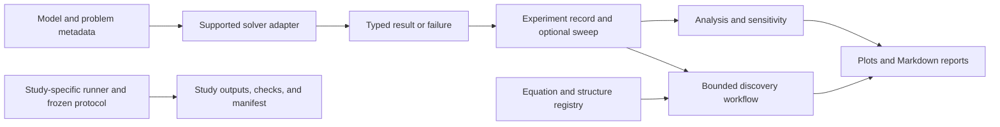

# Newton Lab — Technical Project Summary

## Overview

Newton Lab is a Python scientific-computing and research workspace for testing how mathematical models behave and for carefully describing possible structural connections across systems. A user defines or selects a supported model, runs a solver or a study-specific experiment, and inspects typed outputs, numerical checks, and a report. The software helps organize that process; it does not autonomously discover scientific laws or validate an application merely because two equations look similar.

The installable distribution is named `newton-lab` and the Python package is `newton_lab` (version `0.1.0`). It requires Python 3.11 or newer.

## Technical architecture

For the shared experiment workflow, model-specific adapters connect supported problem descriptions to solvers. Experiments retain run outcomes, metrics, and checks; analysis and reporting consume those records. The knowledge registry supplies declared equation metadata and relationships for comparison. Separate research modules run their own frozen studies and produce protocol-specific artifacts.

The shared ODE adapters cover the damped oscillator and nonlinear pendulum. The experiment defaults also cover the nonlinear algebraic example and boundary-value problems, but their numerical outputs remain distinct types: time trajectories, algebraic candidate roots, and spatial BVP profiles are not interchangeable. The project does not provide one universal runner for every research module.

## Technical highlights

### Solver and experiment contracts

- `SimulationProblem`, solver capability records, ODE configuration, and family-specific results/failures are implemented in [`simulation.py`](../src/newton_lab/simulation.py) and [`simulation_adapters.py`](../src/newton_lab/simulation_adapters.py). The ODE adapters use SciPy `solve_ivp`; they do not provide automatic solver selection or event handling. Tolerances are settings, not guarantees of global error.
- The direct oscillator and full-sine damped-pendulum models are in [`dynamics.py`](../src/newton_lab/dynamics.py) and [`pendulum.py`](../src/newton_lab/pendulum.py). The pendulum model keeps its nonlinear sine restoring term.
- [`algebraic.py`](../src/newton_lab/algebraic.py) solves finite-dimensional nonlinear residual systems. It records initial guesses, solver convergence, residual acceptance, and physical validity as distinct concerns; a successful local solve does not establish uniqueness.
- [`boundary_value.py`](../src/newton_lab/boundary_value.py) provides a separate SciPy collocation BVP solver with a steady one-dimensional heat-conduction example.
- [`experiments.py`](../src/newton_lab/experiments.py) defines supported experiment specifications, ordered single-parameter sweeps, retained per-point failures, reference comparisons, and central finite-difference sensitivity. Sensitivity is a local finite difference, not a causal effect estimate.

### Analysis, discovery, and reporting

- [`experiment_analysis.py`](../src/newton_lab/experiment_analysis.py) summarizes existing experiment records, examines sweeps, and compares metrics. Cross-model comparison needs an explicit compatibility declaration when model, definition, or unit metadata differ; the module does not silently convert units.
- [`knowledge/registry.py`](../src/newton_lab/knowledge/registry.py) and [`knowledge/structure.py`](../src/newton_lab/knowledge/structure.py) store typed equation/source/structure metadata and compare declared features. Equation strings are descriptive; they are not executable symbolic mathematics, and metadata comparison is not symbolic equivalence proof.
- [`discovery.py`](../src/newton_lab/discovery.py) exposes `run_discovery(records, ...)`. It characterizes selected metrics, sweep changes, and limited retained-trajectory descriptors, then compares declared structures and returns proposed hypotheses and Markdown. It does not run a solver, infer arbitrary equations, establish causality, or validate a target-domain application.
- [`visualization.py`](../src/newton_lab/visualization.py) builds plots and Markdown reports from supported experiment and analysis records. Study-specific modules also write their own reports, tables, figures, metadata, and SHA-256 manifests.

## Selected research examples

### Discrete path modes and heat diffusion — Phase 48

For a uniform nearest-neighbor path with fixed leaders, the discrete low-mode decay rates were compared with fixed-end heat-equation mode rates. Across the tested grids, the report gives fitted refinement orders of 1.99942, 1.99767, and 1.99476 for modes 1–3; fitted rates agreed closely with exact discrete eigenvalues. This supports a narrow second-order convergence result for the matched stencil and boundary setup (**analytic and numerical evidence**). It does not establish convergence for arbitrary graphs or validate a measured thermal system. See the [Phase 48 report](research/phase_48_pinned_path_convergence.md) and its [implementation](../src/newton_lab/pinned_path_network.py).

### Finite-size Kuramoto transition — Phases 60–61

The project simulated a phase-only, all-to-all Kuramoto population and compared finite-population transition estimates with a continuum reference for a declared truncated-Lorentzian frequency distribution. At population sizes 512 and 1024, bootstrap intervals included the reference but were too wide for the frozen agreement rule; point estimates fell on opposite sides. The recorded conclusion is **inconclusive under the declared protocol**. It does not establish either finite-size convergence or its absence, and it concerns a synthetic phase model rather than a measured population. See the [Phase 60 report](research/phase_60_kuramoto_synchronization.md) and [Phase 61 report](research/phase_61_kuramoto_transition_finite_size.md).

### Pitchfork path dependence — Phase 62

For `dx/dt = mu(t)x - x^3`, a frozen triangular parameter ramp produced finite-rate differences between upward and downward paths for nonzero initial conditions. The stable equilibrium magnitude is single-valued, so this model has no quasi-static magnitude hysteresis. The hypothesis that a slower ramp reduces the loop was **inconclusive**: the measured area was larger for the slower of the two tested ramps, and the pilot did not isolate the cause. This is a result for one normal form and protocol, not a general ramp law. See the [Phase 62 report](research/phase_62_pitchfork_path_dependence.md) and [study outputs](../reports/phase_62_pitchfork_path_dependence/).

### Stable non-normal transient gain — Phase 64

The study compared a stable diagonal normal matrix with a triangular non-normal family sharing eigenvalues `-1` and `-2`. In an explicitly abstract, dimensionless two-state space with a Euclidean norm and finite horizon, the sampled gain was 1.174353 at coupling 4 and 2.080046 at coupling 8; coupling 2 did not exceed the declared positive-time threshold. The closed-form propagator was checked against `scipy.linalg.expm`, and selected ODE trajectories were checked against the analytical solution. These results illustrate finite-time gain within the declared family; they are not exact continuous-time peak claims or physical-system evidence. See the [Phase 64 report](research/phase_64_non_normal_transient_growth.md) and [manifested artifacts](../reports/phase_64_non_normal_transient_growth/).

The recovery-rate-scaling sequence (Phases 48–57) is closed for now under the [Phase 58 decision](research/phase_58_research_thread_closure.md). Across that synthetic sequence, classification, rate estimation, and exponent identifiability produced distinct outcomes. The reports do not supply independent application validation.

## Engineering practices evidenced in the repository

- Public problem and result models use type annotations and validation; solver families retain different result contracts.
- Tests cover model validation, solver outcomes, analysis, and selected mathematical/numerical references. `pyproject.toml` configures pytest, Ruff, and strict mypy for Python 3.12 typing checks.
- Research-specific protocols record experimental settings and acceptance criteria; selected runners preserve metadata and output hashes. Phase 64's report records analytic-reference, trajectory, grid-refinement, and repeat-manifest checks.
- Documentation distinguishes assumptions, numerical acceptance, physical validity, hypotheses, and unresolved findings.

This summary task did not run tests or experiments. The Phase 64 report records its own verification results, including 14 focused tests and 614 tests in the full suite at that time; those historical results are not a fresh project-wide test claim.

## Limitations and current status

- Newton Lab is a scientific-computing and research platform, **not a validated financial trading system**. It makes no profitability or market-prediction claim.
- Cross-domain hypotheses require independent validation in the target domain. No such engineering or financial validation was identified in the audited records.
- Phase 32 remains `BLOCKED_AUTHORIZATION`; financial-data acquisition or analysis requires documented permission for the specific source and intended use.
- Phase 52 remains `NO-GO`: no qualified engineering candidate is documented.
- The Kuramoto thread remains `CLOSED — INCONCLUSIVE UNDER THE DECLARED PROTOCOL`. Phase 62's slower-ramp hypothesis remains inconclusive. Phase 64 is bounded by its model family, norm, coordinates, finite horizon, and sampling grid.
- The [project checkpoint](project_checkpoint.md) keeps research paused, permits narrowly justified maintenance, and authorizes no new phase. This summary does not authorize Phase 65.

## Portfolio description

**One sentence:** Newton Lab is a typed Python research workspace for simulating selected physical models, running reproducible numerical experiments, and carefully comparing declared mathematical structures.

**Technical paragraph:** Newton Lab combines SciPy-based ODE, nonlinear algebraic, and boundary-value solver families with typed experiment records, parameter sweeps, finite-difference sensitivity, cross-family metric analysis, equation metadata, and bounded report-generation/discovery APIs. Its research studies pair mathematical predictions with numerical checks and frozen synthetic protocols. Results are deliberately scoped: the platform does not perform general symbolic discovery, prove physical equivalence from structural similarity, or demonstrate financial or engineering effectiveness without independent target evidence.

**Technologies verified from project configuration:**

- Python 3.11+; package `newton-lab`.
- NumPy, SciPy, pandas, and Pydantic at runtime.
- Matplotlib as an optional visualization dependency.
- pytest, Ruff, and mypy as development tools.

**Demonstrations using existing material:**

- Run the documented [`run_discovery` example](discovery.md) on an oscillator experiment and inspect its observations, structural match, proposed hypothesis, and Markdown report.
- Walk through the [Phase 64 report and outputs](research/phase_64_non_normal_transient_growth.md) to show an analytical propagator, a matched-spectrum baseline, numerical cross-checks, and a hash-verified artifact set.
- Compare the [Phase 61 report](research/phase_61_kuramoto_transition_finite_size.md) and its [results](../reports/phase_61_kuramoto_transition_finite_size/) to demonstrate how a reproducible experiment can end inconclusively when frozen precision criteria are not met.
- Review the [Phase 62 path-area results](../reports/phase_62_pitchfork_path_dependence/path_metrics.csv) alongside the report to distinguish finite-rate path dependence from quasi-static hysteresis.

## Links

- [Project README](../README.md)
- [Project checkpoint and research freeze](project_checkpoint.md)
- [Research Atlas and roadmap](research/phase_51_research_atlas_and_roadmap.md)
- [Research synthesis and capability-gap audit](research/research_synthesis_capability_gap_audit.md)
